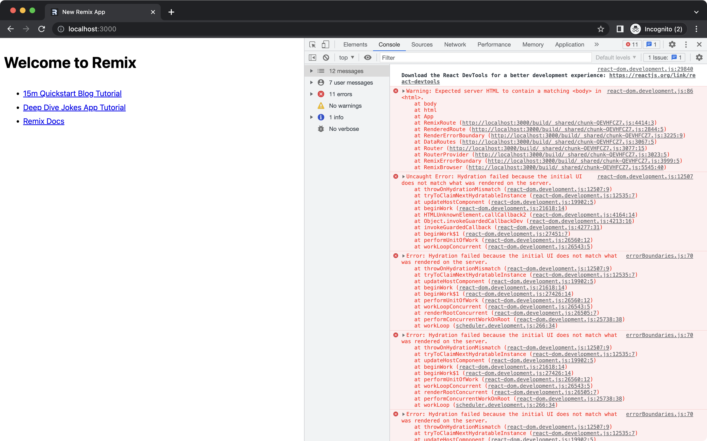

# Startup

From your terminal:

```sh
npm ci
npm run dev
```

## Code

The only code that has been changed after running

```sh
 npx create-remix@latest
```

is `line 24` in `/app/root.tsx` where I added the following script to `<head>`:

```sh
<script src="https://pagead2.googlesyndication.com/pagead/js/adsbygoogle.js" />
```

## Check browser console



## Browser version

- Chrome Version 113.0.5672.126 (Official Build) (arm64)
- Safari Version 16.4.1 (17615.1.26.101.10, 17615)

## System

- macOS Monterey version 12.6.5
- M1 Pro chip
